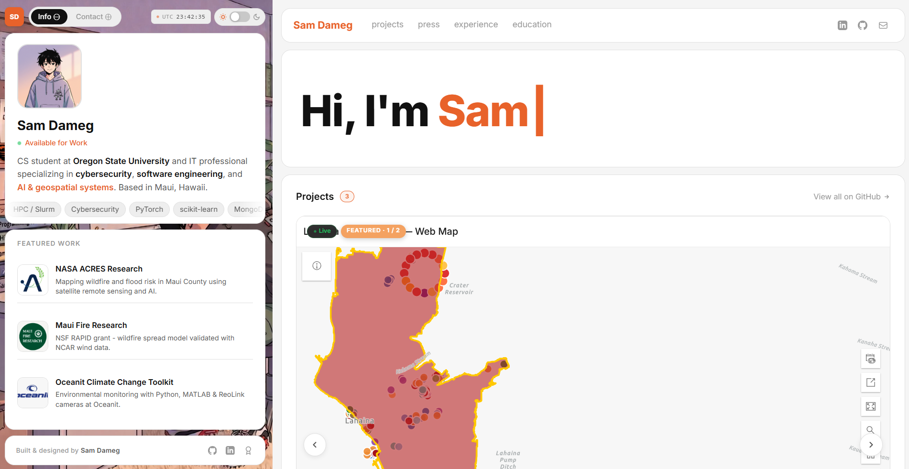

<p align="center">
  
</p>
<h1 align="center">
  Sam Dameg Portfolio - v3
</h1>
<p align="center">
  The third iteration of my personal portfolio. <a href="https://portfolio-hazel-eight-1eo8p12f3a.vercel.app/" target="_blank">Live site</a>. A lofi anime aesthetic split-panel portfolio built with Vite and React 19, featuring carousels across every major section, an embedded interactive ArcGIS map of my Lahaina Fire Timeline research, an interactive lofi character with suggested questions, scroll-triggered animations, and a light/dark theme.
</p>
<p align="center">
  
</p>

## about

Personal portfolio for Sam Dameg, IT Specialist at the Hawaii State Department of Education and Computer Science Cybersecurity student at Oregon State University. Based in Maui, Hawaii.

The site uses a fixed left panel with stacked cards (profile, featured work, footer) and a scrollable right panel with sticky navigation. The carousel pattern runs across Projects, Press & Publications, Experience, Education, and Recognition sections, surfacing the highlight reel up top with arrows and pagination dots for navigation. The contact panel character is interactive: click them to reveal suggested questions that pre-fill the message input.

## tech stack

- **Vite 7** + **React 19**
- **Tailwind CSS v4** with custom CSS variables for theming
- **CSS-only animations** (no animation library)
- **IntersectionObserver** for scroll reveals
- **ArcGIS Maps SDK for JavaScript** (embedded web map component) for the live Lahaina Fire Timeline
- **Phaser 3** for the Cyberrunner sub-page (currently disabled, source in `src/cyberrunner/` ready to re-enable)
- Deployed on **Vercel**

## set-up

1. Install the dependencies

   ```sh
   npm install
   ```

2. Start the development server

   ```sh
   npm run dev
   ```

## build and run for production

1. Generate a full static production build

   ```sh
   npm run build
   ```

2. Preview the production build locally

   ```sh
   npm run preview
   ```

## features

- **Split-panel layout** with a fixed left panel and scrollable right panel
- **Card-stack visual system** with staggered slide-in animations
- **Light and dark theme toggle**, persisted to localStorage
- **Carousel pattern** across Projects, Press, Experience, Education, and Recognition sections, each with left/right arrows and pagination dots
- **Live embedded ArcGIS web map** of the Lahaina Fire Timeline research (theme-aware light/dark)
- **Press & Publications section** with 5 featured news articles and a separate Recognition & Research carousel for NSF RAPID grants and Senate certificates
- **Interactive character** with click-to-reveal suggested questions on the contact panel
- **AI-style prompt input** that opens an email draft on submit
- **Sticky right-panel navbar** with scroll-spy tracking across all sections
- **Hi, I'm Sam typewriter** intro animation
- **Scroll-triggered fade and lift reveals** via a shared `useScrollReveal` hook
- **Lofi anime aesthetic** with a custom character and room background art
- **Mobile responsive** layout with stacked panels and reduced-size character

## color codes

| Color           | Hex                                                                |
| --------------- | ------------------------------------------------------------------ |
| Accent Orange   |  `#E8622A`    |
| Accent Hover    |  `#d4541f`    |
| Medium Orange   |  `#F4914A`    |
| Light Peach     |  `#F4A261`    |
| Light BG        |  `#ffffff`    |
| Light Panel     |  `#f5f5f5`    |
| Light Text      |  `#111111`    |
| Dark BG         |  `#0e0e0e`    |
| Dark Panel      |  `#141414`    |
| Dark Text       |  `#f0f0f0`    |

## project structure

```
portfolio/
├── public/                      # Static assets (images, favicon, character art, lofi bg)
├── src/
│   ├── components/
│   │   ├── LeftPanel.jsx        # Fixed left panel (profile, featured work, contact)
│   │   ├── RightNavbar.jsx      # Sticky right-panel navbar with scroll-spy
│   │   ├── Intro.jsx            # Hi, I'm Sam typewriter
│   │   ├── Projects.jsx         # Project carousel with ArcGIS embed + 3-card grid
│   │   ├── Press.jsx            # Press articles carousel + Recognition carousel
│   │   ├── Experience.jsx       # Experience and Education carousels + Certifications grid
│   │   └── GlobalClock.jsx      # UTC clock in toolbar
│   ├── context/
│   │   └── ThemeContext.jsx     # Light / dark theme provider
│   ├── hooks/
│   │   └── useScrollReveal.js   # Shared scroll-reveal hook (IntersectionObserver)
│   ├── cyberrunner/             # Phaser game sub-page (currently disabled in vite.config.js)
│   ├── App.jsx
│   ├── main.jsx
│   └── index.css                # CSS variables, theme tokens, animations
├── cyberrunner.html             # Separate entry for the Phaser game (build target disabled)
├── index.html                   # Main entry, includes ArcGIS embeddable map script
└── vite.config.js               # Multi-page build config
```

## license

MIT
